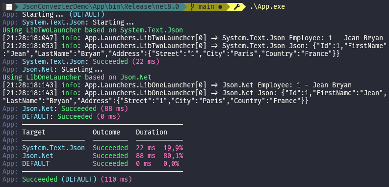

[](https://github.com/aimenux/JsonConverterDemo/actions/workflows/ci.yml)

# JsonConverterDemo
```
Implementing custom serialization/deserialization with JsonConverters
```

> In this repo, i m implementing custom serialization/deserialization with JsonConverters :
>
> :one: Using [Json.Net library](https://www.newtonsoft.com/json)
>
> :two: Using [System.Text.Json library](https://docs.microsoft.com/en-us/dotnet/api/system.text.json)
>
> To run code in debug or release mode, type the following commands in your favorite terminal : 
> - `.\App.exe`
> - `.\App.exe default`
> - `.\App.exe json.net`
> - `.\App.exe system.text.json`
>
>
> 
>

**`Tools`** : vs19, net 5.0, json.net, system.text.json, bullseye
